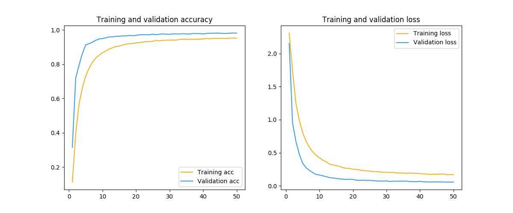

# Convolutional-Neural-Networks

Recognizing hand written digits is considered to be a "hello world" project for machine learning.
In fact it is one of Kaggle's computer vision fundamentals with the famous MNIST data.

## Running the code

To run the code use
 
    python src/main.py --train data/train.csv --test data/test.csv --model svc

## Results

### SVC

### LeNet

### Custom Neural Network

### Ensemble of Neural Networks
