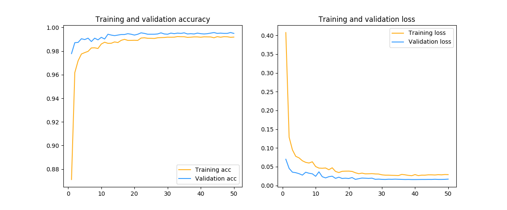
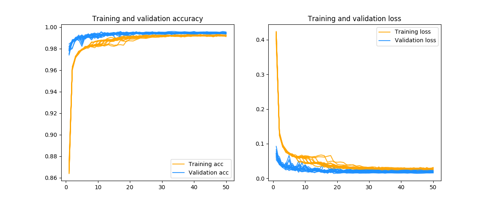

# Convolutional-Neural-Networks

Recognizing hand written digits is considered to be a "hello world" project for machine learning.
In fact it is one of Kaggle's computer vision fundamentals with the famous MNIST data.

## Before you begin
To use virtual environment with jupyter notebooks you need to:
1. make sure you are in the project directory
2. create virtual environment `python3 -m venv env`
3. activate environment `source env/bin/activate`
4. install requirements `pip install -r requirements.txt`
5. after you are done - deactivate environment `deactivate`

## Running the code

To run the code use
 
    python src/main.py --train data/train.csv --test data/test.csv --model svc

## Results

### SVC

### LeNet

### Custom Neural Network

### Committee of Neural Networks

